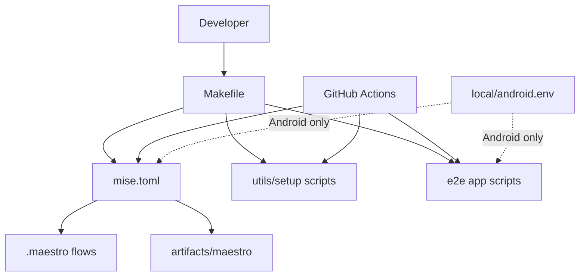
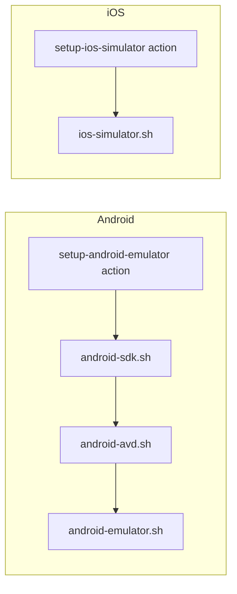
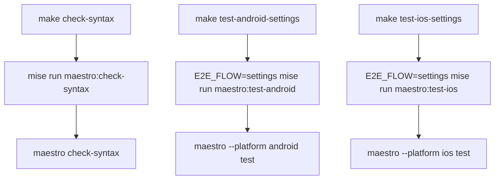
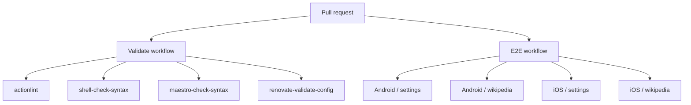
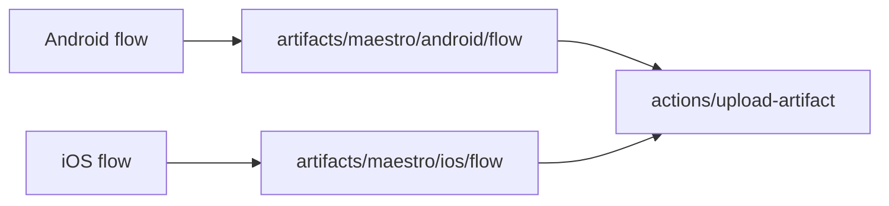

# Architecture

## Target Shape

```mermaid
flowchart TB
  developer[Developer]
  ci[GitHub Actions]

  make[Makefile]
  mise[mise.toml]
  flows[.maestro flows]
  setup[utils/setup scripts]
  local[local/android.env]
  apps[e2e app scripts]
  artifacts[artifacts/maestro]

  developer --> make
  make --> mise
  make --> setup
  make --> apps

  ci --> mise
  ci --> setup
  ci --> apps

  local -. Android only .-> mise
  local -. Android only .-> apps

  mise --> flows
  mise --> artifacts
```

## Runtime Setup

```mermaid
flowchart LR
  subgraph Android
    androidAction[setup-android-emulator action]
    androidSdk[android-sdk.sh]
    androidAvd[android-avd.sh]
    androidEmulator[android-emulator.sh]

    androidAction --> androidSdk --> androidAvd --> androidEmulator
  end

  subgraph iOS
    iosAction[setup-ios-simulator action]
    iosSimulator[ios-simulator.sh]

    iosAction --> iosSimulator
  end
```

## Command Ownership

```mermaid
flowchart TB
  makeCheck[make check-syntax]
  makeAndroid[make test-android-settings]
  makeIos[make test-ios-settings]

  miseCheck[mise run maestro:check-syntax]
  miseAndroid[E2E_FLOW=settings mise run maestro:test-android]
  miseIos[E2E_FLOW=settings mise run maestro:test-ios]

  maestroCheck[maestro check-syntax]
  maestroAndroid[maestro --platform android test]
  maestroIos[maestro --platform ios test]

  makeCheck --> miseCheck --> maestroCheck
  makeAndroid --> miseAndroid --> maestroAndroid
  makeIos --> miseIos --> maestroIos
```

## CI

```mermaid
flowchart TB
  pr[Pull request]

  validate[Validate workflow]
  e2e[E2E workflow]

  actionlint[actionlint]
  shell[shell-check-syntax]
  syntax[maestro-check-syntax]
  renovate[renovate-validate-config]

  androidSettings[Android / settings]
  androidWikipedia[Android / wikipedia]
  iosSettings[iOS / settings]
  iosWikipedia[iOS / wikipedia]

  pr --> validate
  pr --> e2e

  validate --> actionlint
  validate --> shell
  validate --> syntax
  validate --> renovate

  e2e --> androidSettings
  e2e --> androidWikipedia
  e2e --> iosSettings
  e2e --> iosWikipedia
```

## Artifact Flow

```mermaid
flowchart LR
  androidFlow[Android flow]
  iosFlow[iOS flow]
  androidArtifacts[artifacts/maestro/android/flow]
  iosArtifacts[artifacts/maestro/ios/flow]
  upload[actions/upload-artifact]

  androidFlow --> androidArtifacts --> upload
  iosFlow --> iosArtifacts --> upload
```

詳しい設計メモは [IMPLEMENTATION.md](IMPLEMENTATION.md) を参照します。
