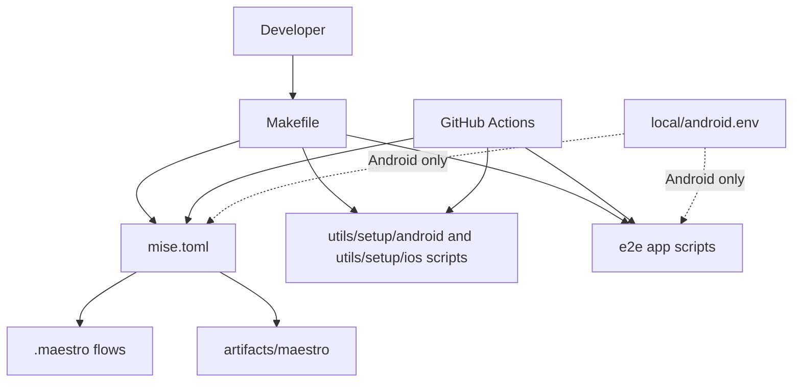
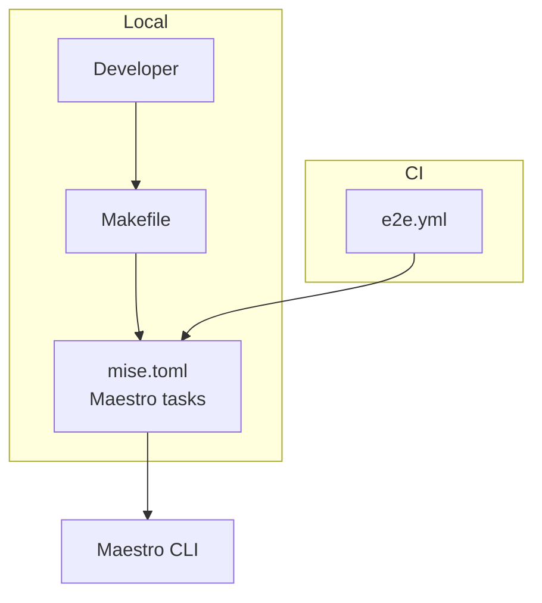
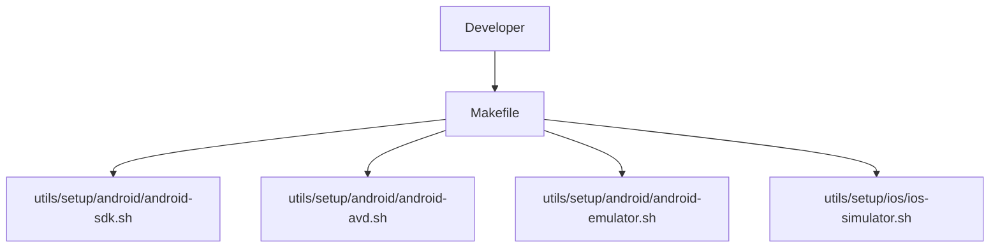
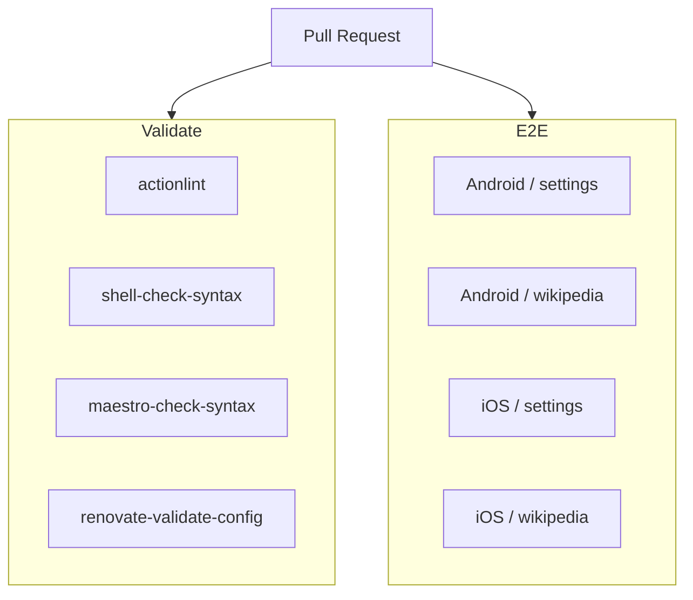
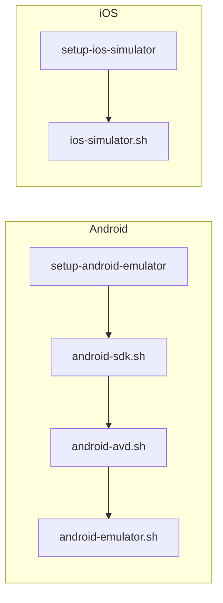
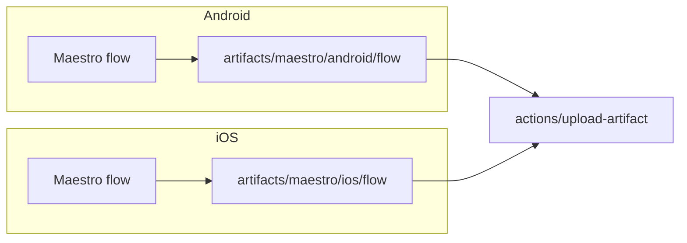

# Architecture

## Repository Overview

ローカルと CI で同じバージョンの `maestro-cli` を使用し、Maestro の実行とテスト環境のセットアップで同じ処理を利用できる構成にしています。

Maestro の実行コマンドや引数は [mise.toml](../mise.toml) の task にまとめています。

ローカルでは Makefile を入口として mise task やセットアップスクリプトを呼び出し、CI では GitHub Actions から直接呼び出します。

Android Emulator / iOS Simulator のセットアップ処理の実体は [mise.toml](../mise.toml) や [Makefile](../Makefile) には含めず、[utils/setup/](../utils/setup/) のスクリプトにまとめています。ローカルでは Makefile の target からそれらのスクリプトを呼び出します。

> [!NOTE]
> iOS の実行は GitHub Actions のみ対応しています。

## Using mise Tasks in Local and CI

Maestro の実行コマンドや引数は [mise.toml](../mise.toml) の task にまとめています。

ローカルでは [Makefile](../Makefile) をラッパーとして使い、用途ごとの target から mise task を呼び出します。

CI では [e2e.yml](../.github/workflows/e2e.yml) から mise task を直接実行し、flow などの値は job や matrix から渡します。

## Runtime Setup

セットアップ処理の実体は [utils/setup/android/](../utils/setup/android/) と [utils/setup/ios/](../utils/setup/ios/) に置きます。

ローカルでは [Makefile](../Makefile) の target を入口にします。

## CI

Pull Request では、`Validate` と `E2E` の workflow を実行します。

### Workflows

`Validate` では workflow、shell script、Maestro flow などの構文を確認します。

`E2E` では Android / iOS の各 flow を実行します。

### Runtime Setup in CI

E2E の実行環境は GitHub Actions の composite action から [utils/setup/](../utils/setup/) のスクリプトを直接呼び出してセットアップします。

### Artifacts

Maestro のテスト結果は `artifacts/maestro/<platform>/<flow>` に出力し、CI では `actions/upload-artifact` を使って保存します。

ローカルでのセットアップやテストの実行方法については [DEVELOPMENT.md](./DEVELOPMENT.md) を参照します。
